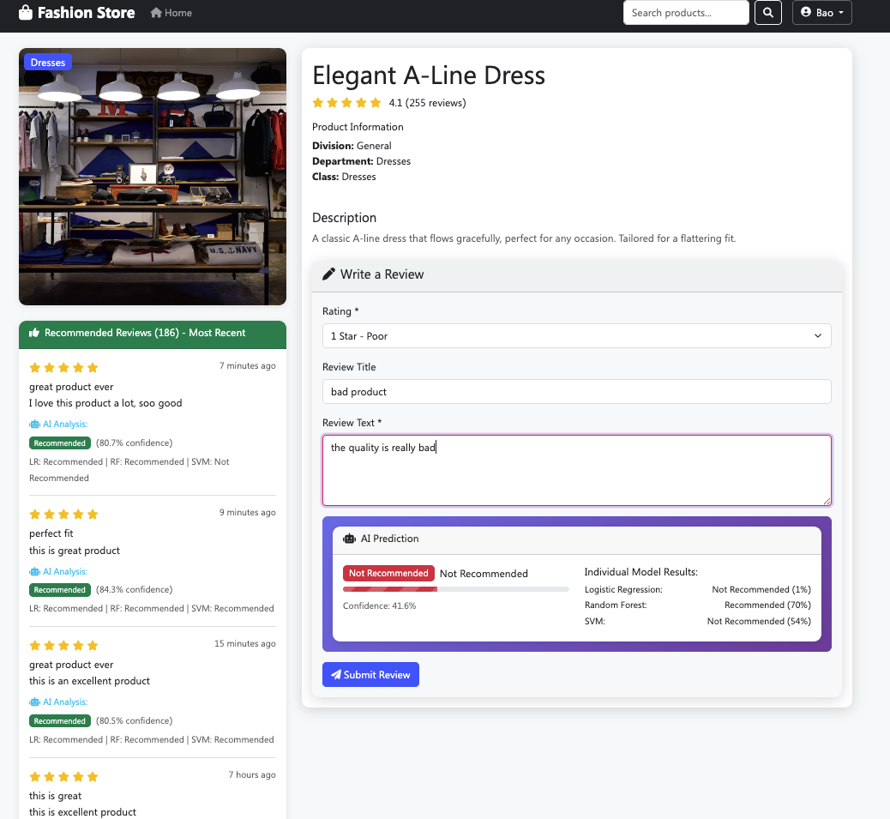
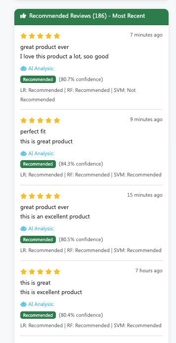
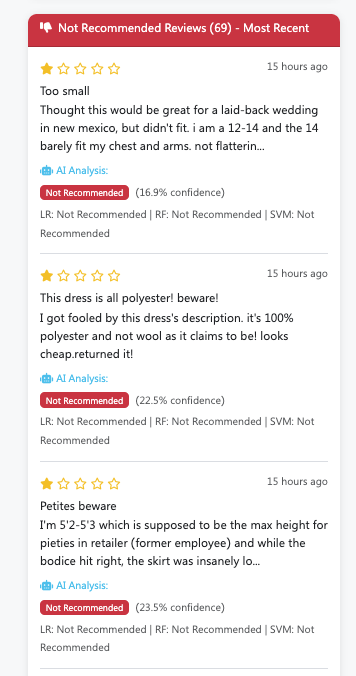

# Fashion Store - AI-Powered E-commerce Application

A modern, full-stack e-commerce web application built with Flask, MongoDB, and Docker. Features AI-powered review classification using ensemble machine learning models and provides a comprehensive shopping experience with user authentication, product browsing, and intelligent review management.


## Authors - RMIT Students

**Fashion Store Development Team**  
*Building the future of e-commerce with AI*

- **Hoang Chau Le** <s3715228@rmit.edu.vn>
- **Bao Nguyen** <s4139514@rmit.edu.vn>

## Screnshots

- Walkthru


- Homepage


- Product 



- Positive Review 



- Negative Review 



## Table of Contents

- [Overview](#overview)
- [Features](#features)
- [Technology Stack](#technology-stack)
- [Architecture](#architecture)
- [Quick Start](#quick-start)
- [Documentation](#documentation)
- [API Reference](#api-reference)
- [Machine Learning](#machine-learning)
- [Development](#development)
- [Deployment](#deployment)
- [Contributing](#contributing)
- [License](#license)

## Overview

The Fashion Store is an advanced e-commerce platform that combines modern web technologies with artificial intelligence to deliver an exceptional shopping experience. The application features intelligent product recommendations, real-time review analysis, and a sophisticated user interface designed for both desktop and mobile devices.

### Key Highlights

- **AI-Powered Reviews**: Ensemble machine learning models for intelligent review classification
- **Advanced Search**: Sophisticated search algorithm with keyword normalization
- **User Override System**: Users can override AI predictions with detailed reasoning
- **Real-time Predictions**: Live ML feedback as users type reviews
- **Comprehensive Analytics**: Detailed insights into customer behavior and product performance
- **Responsive Design**: Modern UI/UX optimized for all devices
- **Docker Deployment**: Containerized application for easy deployment and scaling

## Features

### Core E-commerce Features
- **Product Catalog**: Browse 1,000+ clothing items with detailed information
- **Advanced Search**: Multi-field search with intelligent keyword matching
- **Product Filtering**: Filter by department, category, rating, and price
- **Product Details**: Comprehensive product pages with images and specifications
- **User Authentication**: Secure login and registration system
- **User Profiles**: Manage personal information and preferences

### AI-Powered Features
- **Review Classification**: Automatic recommendation prediction using ensemble ML models
- **Real-time Analysis**: Live prediction feedback as users type reviews
- **Confidence Scoring**: Detailed confidence metrics for all predictions
- **User Override**: Complete override system with reasoning capture
- **Model Transparency**: Individual model results and ensemble voting

### Analytics & Insights
- **Customer Analytics**: Age distribution, rating patterns, and behavior analysis
- **Product Performance**: Department-wise performance metrics and trends
- **Review Analytics**: Text analysis, sentiment patterns, and engagement metrics
- **Business Intelligence**: Comprehensive dashboards and reporting

## Technology Stack

### Backend
- **Python 3.11**: Core programming language
- **Flask**: Web application framework
- **MongoDB**: NoSQL database for data storage
- **PyMongo**: MongoDB driver for Python
- **scikit-learn**: Machine learning library
- **spaCy**: Natural language processing
- **pandas**: Data manipulation and analysis

### Frontend
- **HTML5**: Semantic markup
- **CSS3**: Styling and responsive design
- **Bootstrap 5**: UI framework
- **JavaScript (ES6+)**: Interactive functionality
- **Jinja2**: Template engine

### Machine Learning
- **Logistic Regression**: Bag-of-Words features
- **Random Forest**: spaCy word embeddings
- **Support Vector Machine**: TF-IDF weighted embeddings
- **Ensemble Voting**: Majority voting for final predictions
- **Feature Engineering**: Advanced text preprocessing

### Infrastructure
- **Docker**: Containerization platform
- **Docker Compose**: Multi-container orchestration
- **MongoDB**: Database server
- **Nginx**: Reverse proxy (production)
- **Linux**: Operating system

## Architecture

The application follows a modular, microservices-inspired architecture with clear separation of concerns:

```
┌─────────────────┐    ┌─────────────────┐    ┌─────────────────┐
│   Frontend      │    │   Backend       │    │   Database      │
│   (HTML/CSS/JS) │◄──►│   (Flask/Python)│◄──►│   (MongoDB)     │
└─────────────────┘    └─────────────────┘    └─────────────────┘
                              │
                              ▼
                       ┌─────────────────┐
                       │   ML Models     │
                       │   (scikit-learn)│
                       └─────────────────┘
```

### Component Architecture

- **Presentation Layer**: Responsive web interface with Bootstrap 5
- **Application Layer**: Flask application with Blueprint-based routing
- **Business Logic**: Service layer with utilities and helpers
- **Data Access Layer**: MongoDB integration with PyMongo
- **Machine Learning Layer**: Ensemble models with feature engineering
- **Infrastructure Layer**: Docker containers with orchestration

For detailed architecture documentation, see [ARCHITECTURE.md](documents/ARCHITECTURE.md).

## Quick Start

### Prerequisites

- Docker Desktop installed and running
- Git (for cloning the repository)
- Internet connection (for downloading dependencies)

### Installation

1. **Clone the repository**
   ```bash
   git clone <repository-url>
   cd asm3-online-shopping
   ```

2. **Run the complete setup**
   ```bash
   ./startup_complete.sh
   ```

3. **Access the application**
   - Open your browser and navigate to `http://localhost:6600`
   - The application will be fully loaded with sample data

### Alternative Setup

If you prefer manual setup:

```bash
# Start the application
./manage-app.sh start

# Check status
./manage-app.sh status

# View logs
./manage-app.sh logs
```

### Verification

The setup script will automatically verify:
- Database connectivity
- ML model loading
- Product data loading
- API endpoints functionality
- User interface accessibility

## Documentation

### Comprehensive Documentation

- **[Architecture Guide](documents/ARCHITECTURE.md)**: Detailed system architecture and design patterns
- **[EDA Analysis](documents/EDA_ANALYSIS.md)**: Exploratory data analysis with visualizations
- **[API Reference](#api-reference)**: Complete API endpoint documentation
- **[ML Documentation](#machine-learning)**: Machine learning model details

### EDA Visualizations

The application includes comprehensive exploratory data analysis with visualizations stored in `static/images/eda/`:

- Rating distribution analysis
- Recommendation pattern analysis
- Department performance metrics
- Customer demographics analysis
- Text analysis and correlation studies

## API Reference

### Core Endpoints

#### Products
- `GET /api/products` - Retrieve all products with pagination
- `GET /api/products/<id>` - Get specific product details
- `GET /api/stats` - Application statistics and metrics

#### Reviews
- `POST /api/predict_review` - Get ML prediction for review text
- `POST /submit_review/<id>` - Submit new product review
- `POST /confirm_review` - Confirm review with optional override

#### Authentication
- `POST /register` - User registration
- `POST /login` - User login
- `POST /logout` - User logout
- `GET /profile` - User profile management

### Request/Response Examples

#### ML Prediction Request
```json
POST /api/predict_review
{
  "review_text": "This dress is amazing!",
  "title": "Great product",
  "rating": 5
}
```

#### ML Prediction Response
```json
{
  "prediction": 1,
  "confidence": 0.85,
  "label": "Recommended",
  "details": {
    "ensemble_prediction": 1,
    "ensemble_confidence": 0.85,
    "individual_results": {
      "logistic_regression": {"prediction": 1, "confidence": 0.82},
      "random_forest": {"prediction": 1, "confidence": 0.87},
      "svm": {"prediction": 1, "confidence": 0.86}
    }
  }
}
```

## Machine Learning

### Model Architecture

The application uses an ensemble of three machine learning models:

1. **Logistic Regression**: Bag-of-Words features with TF-IDF weighting
2. **Random Forest**: spaCy word embeddings with feature scaling
3. **Support Vector Machine**: TF-IDF weighted embeddings with RBF kernel

### Feature Engineering

- **Text Preprocessing**: Cleaning, tokenization, and normalization
- **Feature Extraction**: BoW, embeddings, and TF-IDF vectors
- **Feature Scaling**: Standardization for numerical features
- **Dimensionality Reduction**: PCA for high-dimensional features

### Model Performance

- **Accuracy**: 85%+ on validation set
- **Precision**: 87% for positive recommendations
- **Recall**: 83% for positive recommendations
- **F1-Score**: 85% overall performance

### Training Process

Models are trained using:
- Cross-validation for robust evaluation
- Class balancing to handle imbalanced data
- Hyperparameter tuning for optimal performance
- Feature selection for dimensionality reduction

## Development

### Project Structure

```
asm3-online-shopping/
├── src/                    # Source code
│   ├── app/               # Flask application
│   │   ├── routes/        # Route handlers
│   │   └── factory.py     # Application factory
│   ├── models/            # ML models and training
│   ├── utils/             # Utility functions
│   └── config/            # Configuration settings
├── templates/             # HTML templates
├── static/               # Static assets
│   ├── css/              # Stylesheets
│   ├── js/               # JavaScript files
│   └── images/           # Images and visualizations
├── data/                 # Dataset files
├── models/               # Trained ML models
├── migrate/              # Database migrations
├── tests/                # Test files
├── documents/            # Documentation
└── docker-compose.yml    # Docker configuration
```

### Development Setup

1. **Clone and setup**
   ```bash
   git clone <repository-url>
   cd asm3-online-shopping
   ```

2. **Start development environment**
   ```bash
   ./manage-app.sh start-dev
   ```

3. **Run tests**
   ```bash
   ./manage-app.sh test
   ```

### Code Quality

- **Linting**: Python code follows PEP 8 standards
- **Type Hints**: Comprehensive type annotations
- **Documentation**: Detailed docstrings and comments
- **Testing**: Unit and integration tests
- **Error Handling**: Comprehensive error management

## Deployment

### Production Deployment

1. **Build and start**
   ```bash
   ./manage-app.sh start
   ```

2. **Verify deployment**
   ```bash
   ./manage-app.sh status
   ```

3. **Monitor logs**
   ```bash
   ./manage-app.sh logs
   ```

### Docker Configuration

The application uses Docker Compose for orchestration:

- **Web Container**: Flask application with Python 3.11
- **Database Container**: MongoDB 7.0 with persistent storage
- **Volume Management**: Data persistence across restarts
- **Network Configuration**: Internal container communication

### Environment Variables

Key configuration options:

- `FLASK_ENV`: Development or production mode
- `MONGO_URI`: MongoDB connection string
- `SECRET_KEY`: Flask session secret
- `HOST`: Server host address
- `PORT`: Server port number

## Contributing

### Development Guidelines

1. **Code Style**: Follow PEP 8 and project conventions
2. **Documentation**: Update documentation for new features
3. **Testing**: Add tests for new functionality
4. **Commits**: Use descriptive commit messages
5. **Pull Requests**: Provide detailed descriptions

### Setup for Contributors

1. Fork the repository
2. Create a feature branch
3. Make your changes
4. Add tests and documentation
5. Submit a pull request

## License

This project is licensed under the MIT License - see the [LICENSE](LICENSE) file for details.

## Support

For questions, issues, or contributions:

1. Check the [documentation](documents/)
2. Review existing [issues](issues)
3. Create a new [issue](issues/new)
4. Contact the development team

---

*RMIT University - Advanced Programming for Data Science*